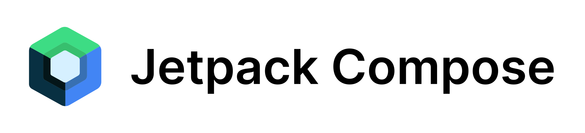

## Hey there, This is Sudarshan here!👋
I'm a software developer who likes to code and enjoys designing and developing software. I started my journey as a Sketchware developer and moved on to the field of Android app development. I'm currently exploring Android app development using Kotlin and Jetpack Compose.

When I was in the 10th standard, I got to know about the Sketchware app, a no-code tool that we can use to develop mobile apps using the mobile phone itself. I developed some toy projects back then and realized what I like doing. After completing my school, I quickly decided to pursue a diploma in computer engineering. From then on, I'm learning how to code and build software that can solve a problem or make somebody's life easier through software.

- 🌱 Technologies I'm exploring right now: Kotlin, Jetpack Compose, Spring Boot using Kotlin, and PostgreSQL.
- 👯 I'm always up for collaborating on Kotlin and Android-related projects.
- 🎓 My education qualification: I have completed my diploma in computer engineering and am currently studying in the 3rd year of B.Tech in computer science and engineering. 
- ⚡ Fun fact: I'm also into music production and writing songs.
- 📫 How to reach me: It's so easy. Just write me an email at [sudarshanmhasrup@gmail.com](mailto:sudarshanmhasrup@gmail.com) or send me a message on my [LinkedIn](https://www.linkedin.com/in/sudarshanmhasrup2).

If you are up for collaborating on projects related to Kotlin & Jetpack Compose, Compose for Desktop, I'm always up for it. Feel free to contact me.

### My technology stack
Here is a list of the technologies I know, and I use quite often and regularly.

 
